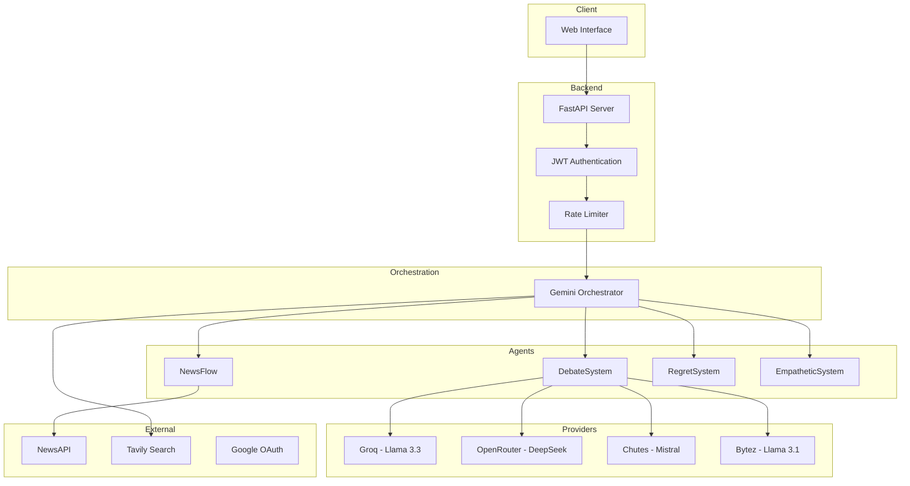

# Hike.ai

Hike.ai is a unified AI platform that orchestrates multiple AI systems for intelligent conversation, decision support, real-time news analysis, and multi-model debate simulation.

## Live Demo

https://hike-ai.onrender.com

## Features

### AI Chat with Orchestration
- Gemini-powered intent analysis and response synthesis
- Multi-provider support (Groq, OpenRouter, Bytez, Chutes)
- Real-time research via Tavily API
- Emotion detection and empathetic responses

### News Flow
- Real-time news aggregation via NewsAPI
- Auto-updating every 60 seconds
- News summarization using Gemini

### Debate Arena
- Multi-model AI debates on any topic
- Supports 4 providers: Groq (Llama 3.3), OpenRouter (DeepSeek), Bytez, Chutes
- Research-augmented debates with Tavily

### Regret AI
- Decision analysis and outcome prediction
- Sentiment-based scoring
- Action recommendations across career, finance, health, relationships

### Authentication
- Email/password login with bcrypt hashing
- Google OAuth 2.0 integration
- JWT session management

## System Architecture



## Tech Stack

| Component | Technology |
|-----------|------------|
| Backend | FastAPI, Python 3.10+ |
| Database | SQLite (SQLAlchemy ORM) |
| Authentication | JWT, bcrypt, Google OAuth |
| AI Orchestration | Google Gemini Pro |
| LLM Providers | Groq, OpenRouter, Bytez, Chutes |
| Research | Tavily API |
| News | NewsAPI |
| Frontend | HTML5, CSS3, Vanilla JavaScript |
| Deployment | Render, Docker |

## API Endpoints

| Method | Endpoint | Description |
|--------|----------|-------------|
| GET | `/` | Main application UI |
| POST | `/api/login` | Email/password authentication |
| POST | `/api/signup` | User registration |
| GET | `/api/profile` | Get user profile |
| POST | `/api/logout` | Logout user |
| GET | `/auth/google` | Google OAuth login |
| GET | `/auth/google/callback` | Google OAuth callback |
| POST | `/api/chat` | Orchestrated AI chat |
| GET | `/api/news/latest` | Get latest news |
| GET | `/api/news/summary` | Get news summary |
| POST | `/api/debate` | Start multi-model debate |
| POST | `/api/decide` | Get decision analysis |
| WS | `/ws/chat` | WebSocket for real-time chat |

## Installation

### Prerequisites
- Python 3.10+
- pip

### Setup

1. Clone the repository:
```bash
git clone https://github.com/sayon999-d/Hike.ai.git
cd Hike.ai/main
```

2. Create virtual environment:
```bash
python -m venv venv
source venv/bin/activate
```

3. Install dependencies:
```bash
pip install -r requirements.txt
```

4. Configure environment:
```bash
cp .env.example .env
```

5. Add your API keys to `.env`:
```
GEMINI_API_KEY=your_key
GROQ_API_KEY=your_key
OPENROUTER_API_KEY=your_key
NEWSAPI_KEY=your_key
TAVILY_API_KEY=your_key
```

## Running Locally

```bash
uvicorn unified_ai:app --reload --port 8000
```

Access at: http://localhost:8000

## Docker

```bash
docker build -t hike-ai .
docker run -p 8000:8000 --env-file .env hike-ai
```

## Deployment on Render

1. Connect your GitHub repository
2. Set Root Directory to `main`
3. Set Build Command: `pip install -r requirements.txt`
4. Set Start Command: `uvicorn unified_ai:app --host 0.0.0.0 --port 10000`
5. Add environment variables from `.env.example`

## Environment Variables

| Variable | Description |
|----------|-------------|
| `SECRET_KEY` | JWT signing key |
| `SESSION_SECRET` | Session encryption key |
| `DATABASE_URL` | SQLite connection string |
| `GEMINI_API_KEY` | Google Gemini API key |
| `GROQ_API_KEY` | Groq API key |
| `OPENROUTER_API_KEY` | OpenRouter API key |
| `NEWSAPI_KEY` | NewsAPI key |
| `TAVILY_API_KEY` | Tavily API key |
| `GOOGLE_CLIENT_ID` | Google OAuth client ID |
| `GOOGLE_CLIENT_SECRET` | Google OAuth secret |

## Project Structure

```
main/
├── unified_ai.py      # Main application (4500+ lines)
├── requirements.txt   # Python dependencies
├── render.yaml        # Render deployment config
├── Dockerfile         # Docker configuration
├── .env.example       # Environment template
└── .gitignore         # Git ignore rules
```

## Key Classes

| Class | Purpose |
|-------|---------|
| `GeminiOrchestrator` | Intent analysis and response coordination |
| `NewsSystem` | News fetching and summarization |
| `EmpatheticSystem` | Emotion detection and empathetic responses |
| `RegretSystem` | Decision analysis and outcome prediction |
| `DebateSystem` | Multi-provider debate orchestration |
| `TokenOptimizer` | Token usage optimization |
| `BudgetManager` | API call budget management |

## License

MIT
