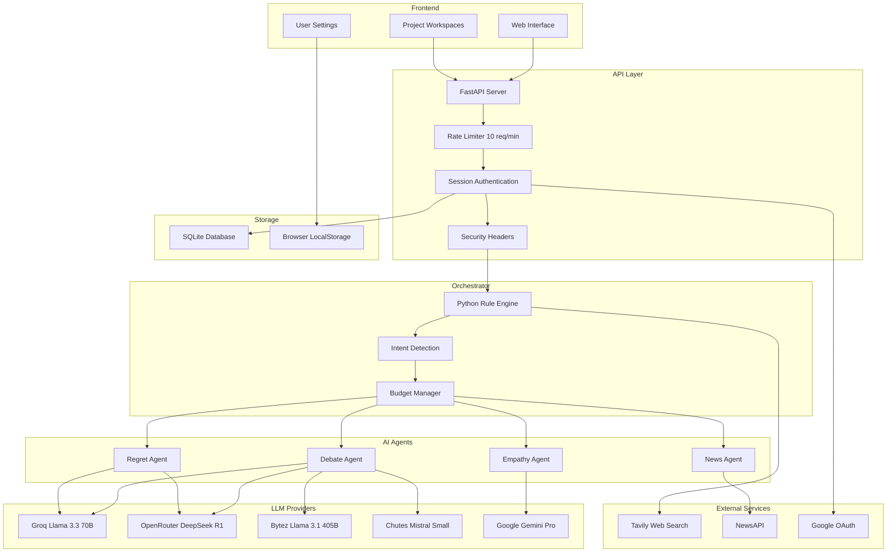
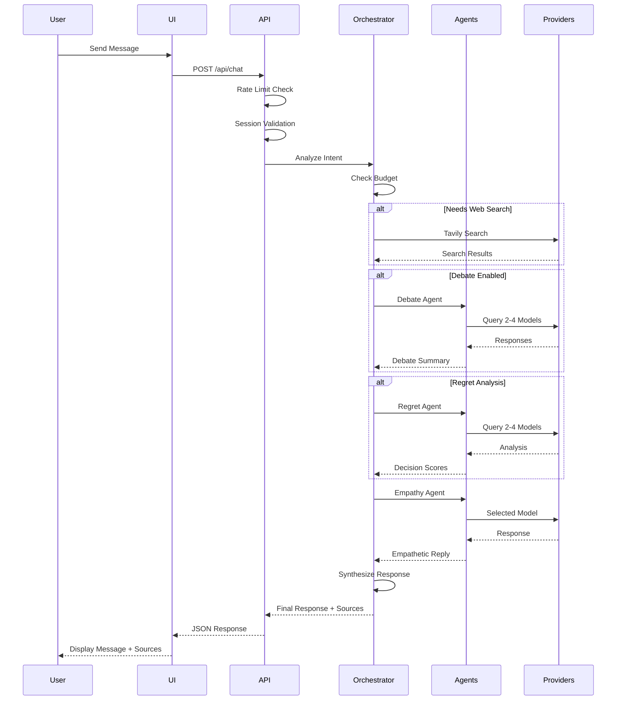

# Hike.ai

Hike.ai is a unified AI platform that orchestrates multiple AI systems for intelligent conversation, decision support, real-time news analysis, and multi-model debate simulation.

## Live Demo

https://hike-ai.onrender.com

## Features

### AI Chat with Orchestration
- Python-based deterministic orchestrator with rule-based intent analysis
- Multi-provider support with Groq, OpenRouter, Bytez, Chutes
- Real-time web search via Tavily API
- Emotion detection and empathetic responses
- Project-based chat workspaces with separate history

### News Flow
- Real-time news aggregation via NewsAPI
- Auto-updating every 60 seconds
- Semantic search with sentence transformers

### Debate Arena
- Multi-model AI debates on any topic
- Select 2-4 models from Groq, OpenRouter, Bytez, Chutes
- Research-augmented debates with Tavily

### Regret AI
- Decision analysis and outcome prediction
- Select 2-4 models for analysis
- Action recommendations across career, finance, health, relationships

### Empathy AI
- Single model selection for empathetic responses
- Emotion-aware conversation handling

### Authentication
- Email/password login with bcrypt hashing
- Google OAuth 2.0 integration
- Session-based authentication with secure cookies

## System Architecture



## Request Flow



## Tech Stack

| Component | Technology |
|-----------|------------|
| Backend | FastAPI, Python 3.11 |
| Database | SQLite with SQLAlchemy ORM |
| Authentication | bcrypt, Session Cookies, Google OAuth |
| Orchestration | Python Deterministic Rules |
| LLM Providers | Groq, OpenRouter, Bytez, Chutes, Gemini |
| Web Search | Tavily API |
| News | NewsAPI |
| Embeddings | Sentence Transformers |
| Frontend | HTML5, CSS3, Vanilla JavaScript |
| Deployment | Render, Docker |

## API Endpoints

| Method | Endpoint | Description |
|--------|----------|-------------|
| GET | `/` | Main application UI |
| POST | `/api/login` | Email/password authentication |
| POST | `/api/signup` | User registration |
| GET | `/api/profile` | Get user profile |
| GET | `/api/logout` | Logout user |
| GET | `/auth/google` | Google OAuth login |
| GET | `/auth/google/callback` | Google OAuth callback |
| POST | `/api/chat` | Orchestrated AI chat |
| GET | `/api/news/latest` | Get latest news |
| GET | `/api/news/summary` | Get news summary |
| WS | `/ws/chat` | WebSocket for real-time chat |

## Installation

### Prerequisites
- Python 3.10+
- pip

### Setup

1. Clone the repository
```bash
git clone https://github.com/sayon999-d/Hike.ai.git
cd Hike.ai/backend/main
```

2. Create virtual environment
```bash
python -m venv venv
source venv/bin/activate
```

3. Install dependencies
```bash
pip install -r requirements.txt
```

4. Configure environment
```bash
cp .env.example .env
```

5. Add your API keys to `.env`

## Running Locally

```bash
uvicorn unified_ai:app --reload --port 8000
```

Access at http://localhost:8000

## Docker

```bash
docker build -t hike-ai .
docker run -p 8000:8000 --env-file .env hike-ai
```

## Deployment on Render

1. Connect your GitHub repository
2. Set Root Directory to `backend/main`
3. Set Build Command to `pip install -r requirements.txt`
4. Set Start Command to `uvicorn unified_ai:app --host 0.0.0.0 --port 10000`
5. Add environment variables

## Environment Variables

| Variable | Description |
|----------|-------------|
| SECRET_KEY | JWT signing key (32+ chars) |
| SESSION_SECRET | Session encryption key |
| ENVIRONMENT | Set to production for security |
| DATABASE_URL | SQLite connection string |
| GEMINI_API_KEY | Google Gemini API key |
| GROQ_API_KEY | Groq API key |
| OPENROUTER_API_KEY | OpenRouter API key |
| BYTEZ_API_KEY | Bytez API key |
| CHUTES_API_KEY | Chutes API key |
| NEWSAPI_KEY | NewsAPI key |
| TAVILY_API_KEY | Tavily API key |
| GOOGLE_CLIENT_ID | Google OAuth client ID |
| GOOGLE_CLIENT_SECRET | Google OAuth secret |

## Project Structure

```
backend/
  main/
    unified_ai.py
    requirements.txt
    render.yaml
    Dockerfile
    .env.example
    .gitignore
```

## Key Classes

| Class | Purpose |
|-------|---------|
| DeterministicOrchestrator | Rule-based intent analysis and response coordination |
| BudgetManager | API call and token budget management |
| NewsSystem | News fetching and semantic search |
| EmpatheticSystem | Emotion detection and empathetic responses |
| RegretSystem | Decision analysis and outcome prediction |
| DebateSystem | Multi-provider debate orchestration |
| UserRateLimiter | Per-user rate limiting |

## Security Features

| Feature | Implementation |
|---------|---------------|
| Password Hashing | bcrypt |
| Session Cookies | HttpOnly, SameSite, Secure in production |
| Rate Limiting | 10 requests per minute per IP |
| Security Headers | X-Content-Type-Options, X-Frame-Options, X-XSS-Protection |
| HSTS | Enabled in production |
| Input Validation | Pydantic models with field constraints |
| Secret Validation | Enforced in production mode |

## License

MIT
