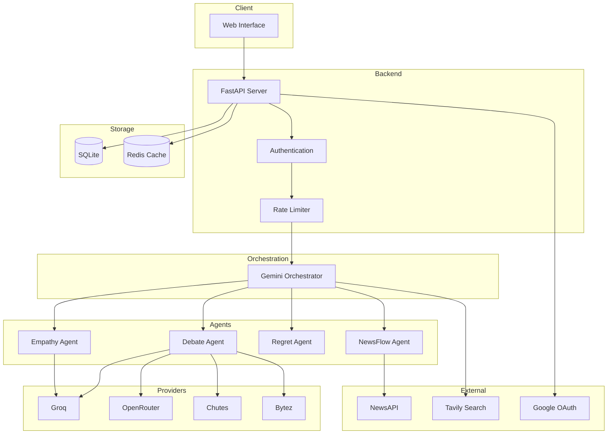
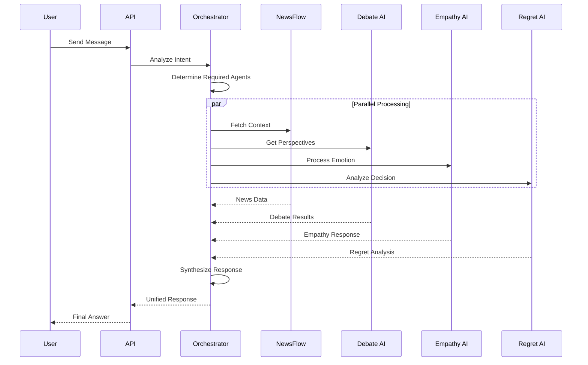

# Hike.ai

Hike.ai is an AI platform that orchestrates multiple AI systems for decision support, empathetic conversation, real-time news analysis, and debate simulation.

## Features

- Empathetic Chat API with emotion detection and adaptive response strategies
- Debate Arena simulating multi-model AI debates using Groq, OpenRouter, Bytez, and Chutes
- Regret AI for decision analysis and future regret prediction
- News Flow for real-time news aggregation and semantic search
- Unified Orchestration via Google Gemini coordinating all subsystems
- Project Board for personal project management with timeline risk analysis

## System Architecture



### Request Processing Flow



### Agent Responsibilities

| Agent | Purpose | Data Source |
|-------|---------|-------------|
| Orchestrator | Intent analysis, coordination, synthesis | Gemini 1.5 Flash |
| NewsFlow | Real-time news context | NewsAPI, Vector Search |
| Debate AI | Multi-perspective analysis | Groq, OpenRouter, Chutes, Bytez |
| Regret AI | Decision outcome prediction | Reasoning Models |
| Empathetic AI | Emotion detection, adaptive response | User-selected LLM |

### AI Provider Matrix

| Provider | Model | Use Case |
|----------|-------|----------|
| Groq | Llama 3.3 70B | Fast inference, Debate |
| OpenRouter | DeepSeek R1 | Complex reasoning |
| Chutes | Mistral Small 3.1 | Balanced performance |
| Bytez | Llama 3.1 8B | Lightweight tasks |
| Gemini | 1.5 Flash | Orchestration |

## Tech Stack

- Backend: FastAPI, Python 3.10
- Database: SQLite (SQLAlchemy), Redis (Caching)
- AI Integration: Google Gemini, Groq, OpenRouter, Tavily, NewsAPI
- Frontend: HTML5, CSS3, Vanilla JS
- Containerization: Docker

## Installation

1. Clone the repository:
```bash
git clone https://github.com/sayon999-d/Hike.ai.git
cd Hike.ai/main
```

2. Create a virtual environment:
```bash
python -m venv venv
source venv/bin/activate
```

3. Install dependencies:
```bash
pip install -r requirements.txt
```

4. Configure Environment:
```bash
cp .env.example .env
```
Fill in your API keys in the .env file.

## Running Locally

```bash
uvicorn unified_ai:app --reload
```

Access the application at http://localhost:8000

## Docker

Build and run with Docker:

```bash
docker build -t hike-ai .
docker run -p 8000:8000 --env-file .env hike-ai
```

## Deployment

For deployment instructions (Render, VPS, CI/CD), see DEPLOYMENT.md

## API Endpoints

| Method | Endpoint | Description |
|--------|----------|-------------|
| GET | / | Main application UI |
| POST | /api/login | User authentication |
| POST | /api/signup | User registration |
| GET | /api/profile | Get user profile |
| POST | /api/chat | Send message to AI |
| GET | /api/news/latest | Get latest news |
| POST | /api/debate | Start multi-model debate |
| POST | /api/decide | Get decision analysis |
| WS | /ws/chat | WebSocket for real-time chat |

## API Documentation

Access interactive API docs at http://localhost:8000/docs

## License

MIT
