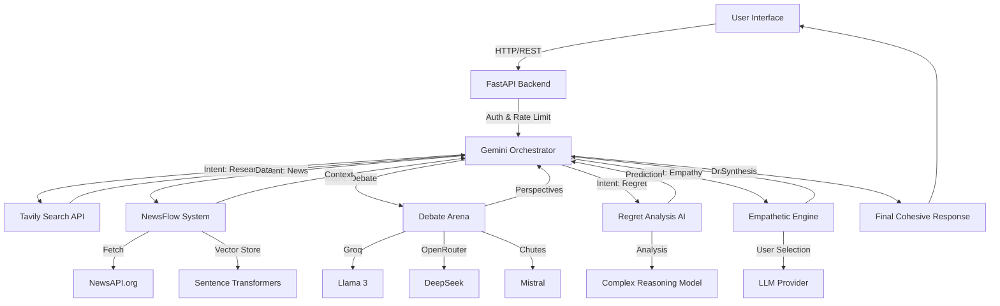

# Hike.ai - Unified AI System

Hike.ai is an advanced AI platform that orchestrates multiple AI systems to provide comprehensive decision support, empathetic chat, real-time news analysis, and debate simulation.

## Features

- **Empathetic Chat API**: Detects user emotion and responds with appropriate empathy strategies.
- **Debate Arena**: Simulates debates between varying AI models (Groq, OpenRouter, Bytez, Chutes) to provide diverse perspectives.
- **Regret AI**: Analyzes potential decisions to predict and minimize future regret.
- **News Flow**: Aggregates and summarizes real-time news using NewsAPI and vector search.
- **Unified Orchestration**: Uses Google Gemini to coordinate all subsystems based on user intent.
- **Project Board**: Manage personal projects with timeline risk analysis.

## System Architecture

The system follows a modular, micro-orchestration architecture where **Google Gemini** acts as the central brain, coordinating specialized sub-systems.



### Components

1.  **Frontend**: A responsive HTML/JS interface with real-time updates, project management, and settings control.
2.  **Orchestrator (Gemini 1.5)**: Analyzes user intent (e.g., "Should I buy this?", "I feel sad") and routes the request to the appropriate specialized agents.
3.  **Specialized Agents**:
    *   **NewsFlow**: Runs a background thread fetching global news every 60s, vectorizes it, and enables semantic search.
    *   **Debate Arena**: Spawns multiple AI personas (via Groq, OpenRouter) to debate a topic from conflicting viewpoints.
    *   **Regret AI**: Uses advanced reasoning to predict long-term emotional and practical regret of a decision.
    *   **Empathetic Engine**: Detects micro-emotions and tailors the response tone (Supportive, Tough Love, Analytical).

## Tech Stack

- **Backend**: FastAPI, Python 3.10
- **Database**: SQLite (SQLAlchemy), Redis (Caching)
- **AI Integration**: LangChain, Google Gemini, Groq, OpenRouter, Tavily, NewsAPI
- **Frontend**: HTML5, CSS3, Vanilla JS (Embedded Jinja2 templates)
- **Containerization**: Docker

## Installation

1. Clone the repository:
   ```bash
   git clone https://github.com/sayon999-d/Hike.ai.git
   cd Hike.ai/backend
   ```

2. Create a virtual environment:
   ```bash
   python -m venv venv
   source venv/bin/activate  # On Windows: venv\Scripts\activate
   ```

3. Install dependencies:
   ```bash
   pip install -r requirements.txt
   ```

4. Configure Environment:
   Copy `.env.example` to `.env` and fill in your API keys.
   ```bash
   cp .env.example .env
   ```

## Running Locally

```bash
uvicorn unified_ai:app --reload
```

Access the application at `http://localhost:8000`.

## Docker

Build and run with Docker:

```bash
docker build -t hike-ai .
docker run -p 8000:8000 --env-file .env hike-ai
```

## API Documentation

Once running, access the interactive API docs at `http://localhost:8000/docs`.

## License

MIT
